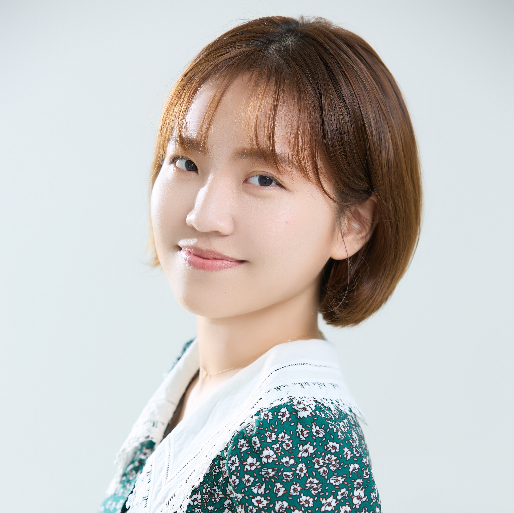

<body oncontextmenu="return false;">
git 

<!-- self profile picture: html-->
 

 
Jiwon Kim | Innovation Maker

 

 
Education

 

 
*Master Course of Engineering, KAIST, Daejeon, South Korea*
  
September 2023 — August 2025  
Industrial Design
 

 
*Bachelor of Arts, Hongik University, Seoul, South Korea*
  
March 2018 — February 2023  
Painting
 
 

 
Courses

 

 
*Educational Exchange, International Summer Course, Technical University of Darmstadt, Germany*
  
June 2024 — July 2024
 

 
*Educational Exchange, BA (Hons) Fine Art, Arts University Bournemouth, Bournemouth, UK*
  
January 2022 — June 2022
 

 
*IOT computer programming and modeling short courses, Hongik University, Seoul, South Korea*
  
August 2020 — September 2020
 
 

 
Awards

 

 
[*2024 James Dyson Award Global top 20*](https://www.jamesdysonaward.org/2024/project/oxynizersustainablenon-electric-oxygen-generator)  
*2024 James Dyson Award Korea Winner*
   
"Oxynizer: Sustainable & Non-electric Oxygen generator", South Korea
 

[*2024 Prototype for Humanity top 100*](https://www.prototypesforhumanity.com/)
   
"Oxynizer: Sustainable & Non-electric Oxygen generator", South Korea
 

 
[*2024 AI x Art Hackathon (3rd Place)*](https://aiart.snu.ac.kr/aiart-hackathon)
  
"Speculative Artificial-Mycorrhizal Networks", Seoul University, Seoul, South Korea
 
 

 
Publications

 

 
[*2024 "Where should we put wearable batteries for better usability?"*](https://www.dbpia.co.kr/journal/articleDetail?nodeId=NODE11714634)
  
Dissertation in HCI Korea, Hongcheon, South Korea
 
 

 
Exhibitions

 

 
[*2022 "Days, Days, Days!"*](https://www.instagram.com/p/ClxlzabAmv9/)
   
Hongik Painting Degree Show, Hongik University, Seoul, South Korea
 

 
[*2018 "Yaoeseukechijeon"*](https://www.instagram.com/p/Bj2NTbalSQl/)
  
Hongik Painting group exhibition and management, Hongik University,
Seoul, South Korea
 
 

 
Internships

 

 
*Intern curator at [Alternative Space LOOP](http://altspaceloop.com/exhibitions/hcy-returnhome-2021), Seoul, South Korea*
  
June 2021 — August 2021  
Artwork installation management, artist research, and press
management.

 
*Art teacher at Hongik University Middle School, Seoul, South Korea*
  
May 2021 — December 2021  
Introducing artist's works, demonstrating art using various
medium, and engaging student's interest in art
 
 

 
Skills

 

*Physical computer programming 𒊹𒊹𒊹𒊹*
  
Arduino (C, C++)
 

*Painting & Drawing 𒊹𒊹𒊹𒊹*
  
Traditional and Digital
 

*Adobe designing 𒊹𒊹𒊹𒊹*
  
Photoshop, Illustrator, Premiere pro, and Indesign
 

*3D modeling & 3D printing 𒊹𒊹𒊹*
  
Fusion 360, Rhino, and 3D MAX
 

*Game / VR making 𒊹𒊹𒊹*
  
Unity and Python
 

*Art tutoring & Art event management 𒊹𒊹𒊹*
  
Art teacher, Gallery intern, and Exhibiton management
 

*Audio engineering 𒊹𒊹*
  
Ableton and MAX msp
 
 

 
Languages

 

*English 𒊹𒊹𒊹𒊹𒊹*  
*Japanese (Speaking) 𒊹𒊹𒊹𒊹*
 

